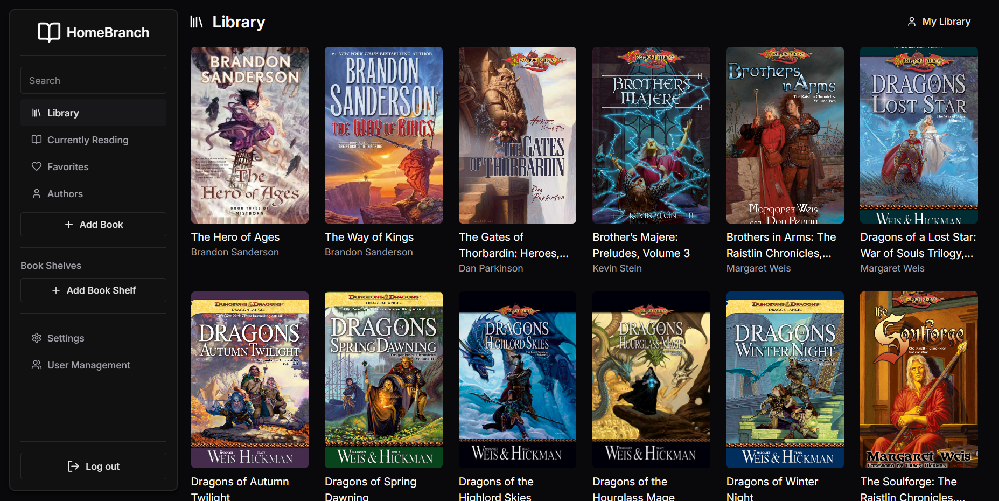
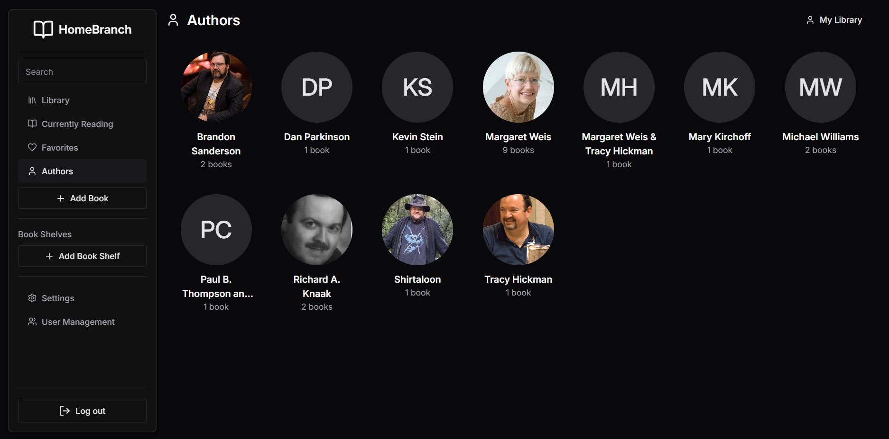

# Homebranch

Homebranch is a self-hosted web application for managing and reading your E-Book collection.
It provides a user-friendly interface to organize, search, and read your ebooks across devices.

> The project is split into 3 repositories allowing you to choose the components you want to use:
> - [Homebranch Web](https://github.com/Oghamark/homebranch-web): The frontend web application built with React and TypeScript
> - [Homebranch](https://github.com/Oghamark/homebranch): The backend API built with NestJS and TypeScript
> - [Authentication](https://github.com/Oghamark/Authentication): A standalone authentication service built with NestJS and TypeScript, which can be used with Homebranch or as a general-purpose auth service for other applications

---

## Preview

---

## Features

- Book management with file upload (EPUB)
- Automatic metadata enrichment from Open Library (genres, publisher, language, ratings, summary, ISBN, page count)
- Optional Google Books enrichment for series info and any fields Open Library didn't populate
- Bookshelves (collections) with many-to-many book relationships
- Favorites and Currently Reading lists
- Cross-device reading position sync
- User management with roles and permissions
- Pagination and search across the library
- OPDS catalog (v1.2 Atom and v2.0 JSON) for e-reader integration — authenticate with email and password via the companion Auth service

---

## Installation

See our [documentation](https://homebranch.app/docs/getting-started/) for installation and configuration instructions.

---

## OPDS

Homebranch exposes an OPDS catalog for e-readers (KOReader, Thorium, etc.).

| Feed | URL |
|---|---|
| OPDS 1.2 catalog root | `/opds/v1/catalog` |
| OPDS 2.0 catalog root | `/opds/v2/catalog` |
| Authentication document | `/opds/v1/auth` *(public)* |

Authentication uses HTTP Basic Auth (email + password). Credentials are forwarded to the companion Auth service — requires `AUTH_SERVICE_URL` to be configured. Without it, the catalog is accessible but login attempts return `401`.

> **Windows / Docker note:** If Thorium is installed from the Microsoft Store, it runs in an AppContainer sandbox that blocks access to `localhost`. Use your machine's LAN IP address (e.g. `http://192.168.1.x:3000/opds/v1/catalog`) instead.

## Contributing

Contributions are welcome! Please see our [contribution guidelines](https://github.com/Oghamark/homebranch/blob/main/CONTRIBUTING.md)  for details on how to get involved.